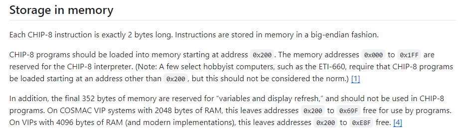

> 最近打算仿真一下GameBoy，搜索了不少教程，发现都比较难，因此打算从经典的chip8开始入门。为了记录，也为了能够帮助到像我一样的小白，所以打算写一篇深度教程，并使用相对比较简单的JS来完成对CHIP-8的仿真。


## 背景

1977年，RCA的工程师Joseph Weisbecker为了简化电子游戏的开发，设计了CHIP-8。CHIP-8最初运行在RCA COSMAC VIP机器上，这是一种基于CDP1802处理器的微型计算机。

CDP1802处理器使用的是自己的机器语言（低级语言），直接与硬件交互。而CHIP-8是一种更高级的解释型编程语言，设计用于简化游戏和应用程序的开发。它提供了一组简化的指令集，使得编程更加直观和便捷。

可以看出CHIP-8 本质上是一门解释型编程语言，这意味着CHIP-8程序的指令不是直接在硬件上执行的，而是由一个解释器（虚拟机）逐条读取并执行。解释器负责将Chip-8指令翻译为底层机器语言指令，并在硬件上执行这些指令。

Chip-8的指令集非常简洁，包括图形绘制、键盘输入、定时器等操作。

这使得Chip-8成为学习计算机仿真和解释器设计的理想入门项目。

### 仿真CHIP-8的本质

由背景可以知道，仿真CHIP-8，实际上就是在现代计算机或者其它设备上模拟CHIP-8虚拟机的行为。

仿真器读取并解释CHIP-8程序的指令，执行相应的操作，并更新虚拟机的状态（如内存、寄存器、显示屏等）。

### 阅读该教程能学会什么？

1. 首先，我们会深入理解CHIP-8的工作原理，让你能够独立使用JS或其它任何你喜欢的语言来完成仿真。
2. 我们能够学会如何阅读官方文档，在大量繁琐的文字中，提炼出最重要的信息。
3. 最重要的，学习完本教程，你能够通过本教材的引导，一步步思考，总结出自己的方法论，进而进一步拓展到其它仿真项目。

## **一、CHIP-8 解释器详解（重要）**

> 这一章节主要是对官方技术参考的拓展讲解，是本教材的核心。很长，但也特别重要，需要花时间认真阅读并理解。不过我可以向你保证，读完这一章，你对CHIP-8的理解会比别人更深；写起代码来也会快很多，因为你知道为什么要这么写，以及出bug时，快速定位到问题是什么。

### 内存详解

CHIP-8最初运行在RCA COSMAC VIP机器上，由于成本和技术所限，当时这台机器配置了4kb的内存。因此，这也是CHIP-8基于4kb内存设计的原因。



官方文档原文

通过阅读官方文档，关于内存可以整理出以下信息

1. 每条 CHIP-8 指令的长度正好为 2 字节。指令以 big-endian 方式存储在内存中。
2. CHIP-8 程序应从地址 0x200 开始加载到内存中。0x000 到 0x1FF 的内存地址保留给 CHIP-8 解释器。也就是前512个字节要留给CHIP-8 解释器。
3. 最后 352 字节的内存保留用于“变量和显示刷新”，不应用于 CHIP-8 程序。
4. 在具有 4096 字节 RAM 的RCA COSMAC VIP机器（和现代的实现）上，只有 0x200 到 0xE8F 的地址是可用的。

总结一下：

| 地址范围        | 大小      | 用途                       |
| --------------- | --------- | -------------------------- |
| `0x000 - 0x1FF` | 512 字节  | CHIP-8 解释器保留          |
| `0x200 - 0xE8F` | 3552 字节 | 用于加载和运行 CHIP-8 程序 |
| `0xEA0 - 0xFFF` | 352 字节  | 变量和显示刷新保留         |

**思考：**

**问题一：为什么说，每条 CHIP-8 指令的长度正好为 2 字节，指令以 big-endian 方式存储在内存又是什么意思？**

答：首先，每条 CHIP-8 指令的长度正好为 2 字节这是为了简化设计而定的，CHIP-8设计的初衷是为了在硬件资源非常有限的系统上运行。固定长度的指令简化了解释器的设计和实现，使得解释器能够更高效地解析和执行指令。其次，基于内存对齐的考虑，使用固定长度的指令可以简化内存访问和指令获取过程，提高执行效率。

以 big-endian（大端存储） 方式存储在内存中，对应的还有小端存储，至于为什么使用大端存储，我猜测，一是为了遵循当时的标准，二是大端存储更符合人类从左到右的阅读习惯。感兴趣的可以去详细了解一下它们的区别。

**问题二：如果你细心计算的话，你会发现`0xE8F~0xEA0` 之间还有大约16字节的空间，这部分空间为什么没有在用?**

答：在CHIP-8的内存布局中，0xE8F到0xEA0之间的空间实际上是未明确分配的。这部分内存区域可以被视为未使用或保留区域，并且通常不会使用到0xE8F到0xEA0之间的内存区域，因为它没有被定义为可用空间。出于兼容性和稳定性的考虑，最好避免使用这段内存。

**问题三：“最后 352 字节的内存保留用于“变量和显示刷新，不应用于 CHIP-8 程序。” 那变量和显示刷新各占多少，为什么这么定？**
答：

1. **显示缓冲区：**显示缓冲区用于存储屏幕上的像素数据。CHIP-8的屏幕显示分辨率是64x32像素，每个像素可以是开（1）或关（0）。因此，显示缓冲区需要64x32/8 = 256 字节。
2. **系统变量：**352-256=96字节，剩余的96个字节就是分配给系统变量的，例如堆栈，寄存器，键盘等。

因此总结下来，CHIP-8的内存最终分配结构如下：

| 地址范围        | 大小      | 用途                               |
| --------------- | --------- | ---------------------------------- |
| `0x000 - 0x1FF` | 512 字节  | CHIP-8 解释器保留                  |
| `0x200 - 0xE8F` | 3552 字节 | 用于加载和运行 CHIP-8 程序         |
| `0xEA0 - 0xEFF` | 96 字节   | 系统变量使用，堆栈，寄存器，键盘等 |
| `0xF00 - 0xFFF` | 256 字节  | 视频缓冲区，显示刷新保留           |

### 寄存器详解

寄存器是计算机系统中一种非常快速且有限的存储器，用于临时存储数据和指令，在CPU中起着至关重要的作用。


在CHIP-8中有两种寄存器：数据寄存器和地址寄存器。

**数据寄存器：**
在CHIP-8中，数据寄存器，也叫它V寄存器。

在原文中第一句说：

```
CHIP-8 解释器定义了 16 个通用数据寄存器，每个十六进制数字一个：V0 到 VF。
每个数据寄存器的长度为 8 位，能够存储 0x00 到 0xFF 之间的无符号整数值。

数据寄存器是 CHIP-8 语言提供的主要数据操作手段。
使用各种 CHIP-8 指令，可以加载寄存器的值、加法、减法等。
虽然任何 register 都可用于数据操作，但应该注意的是，VF register 通常由某些指令修改以充当标志。
```

信息如下：

1. CHIP-8 有 16 个通用数据寄存器，用于存储临时数据。这些寄存器的名字分别是 V0, V1, V2, ..., V9, VA, VB, VC, VD, VE, VF。这里的 "V" 表示寄存器，后面的数字或字母表示寄存器的索引。
2. 每个寄存器的长度为 8 位（1 字节），这意味着每个寄存器可以存储一个 8 位的二进制数。
3. 由于每个寄存器是 8 位的，它们可以存储的数值范围是从 0 到 255（十进制），或者从 0x00 到 0xFF（十六进制）。这些值都是无符号整数，也就是说，它们只能表示非负数。
4. 一个寄存器的长度为8位（1字节），16个，就意味着CHIP-8 的 通用数据寄存器总共占用16字节的内存空间。
5. 数据寄存器是 CHIP-8 语言中进行数据操作的主要工具。程序通过寄存器来存储和操作数据。
6. CHIP-8 提供了多种指令来操作这些寄存器。例如，可以使用指令加载值到寄存器、在寄存器之间进行加法和减法操作等。
7. VF 寄存器有别的特殊用途，这个稍后也会了解到，但需要知道是，主要是用来做标志的。

**地址寄存器：**

也叫 I寄存器

16 位地址寄存器 I 用于与读取和写入内存相关的操作。虽然它的宽度为 16 位，但由于 CHIP-8 指令可访问的内存范围，它只能加载 12 位内存地址。

这个比较好理解，前面说过，

1. CHIP-8的设计内存是4kb，用16进制表示就是 `0x000~0xfff` ,最大值二进制表示是 `1111 1111 1111` 刚好12位。
2. 指令集的限制，例如指令`ANNN`：将 12 位地址 NNN 加载到地址寄存器 I 中。A代表操作，NNN代表地址，也是三位。

所以，由于 CHIP-8 的内存模型和指令集限制，它只能加载和使用 12 位内存地址。

### 子例程

原文是这么说的：

```
CHIP-8 解释器必须保证有足够的堆栈空间来支持最多 12 个连续的子例程调用。
现代实现可能希望为超过 12 次调用分配足够的内存。
```

说实话很不好理解，但我们把问题拆开之后，带着问题去找答案就会好一些。

**什么是子例程？**

答：子例程（Subroutine），也称为函数（Function）或过程（Procedure），是一段可以被其他部分的程序多次调用的代码。简单理解就是 一个函数，可以被重复调用。“最多 12 个连续的子例程调用“，也就是说，在CHIP-8中，你的函数里，最多只能嵌套12个函数。

**需要足够的堆栈空间来支持最多 12 个连续的子例程调用，这是为什么，具体需要多少空间，这部分空间应该放在内存哪个位置？**

答：支持最多 12 个连续的子例程调用，这个并没有什么特别的说法，而是受限于当时的硬件限制，这么设计的而已，所以它在后面还补充了一句，在现代的实现中，可能希望超过12次调用。

重要的是，我们之前已经分析了CHIP-8内存的分配结构，其中有提到`0xEA0 - 0xEFF` 的96个字节，用于分给系统变量和堆栈等。那么12次调用需要占用多少内存呢？

这是可以算出来的，由于 CHIP-8 的地址空间是 12 位（0x000 到 0xFFF），所以每个返回地址占用 2 个字节，最大嵌套调用深度是 12 层，因此需要的堆栈空间为：

$\text{堆栈空间} = 12 \times 2 \text{字节} = 24 \text{字节}$

因此`0xEA0 - 0xEFF` 的96个字节，其中有24个要留给堆栈空间。不过我会给堆栈多留一些，让它的嵌套深度达到16层，也就是32字节。

补充一句，在现代实现中，也就是我们自己去仿真时，可用内存是远远大于当时的，所以如果你想取消12次这个限制，可以重新划分一块足够的内存，来留给堆栈空间使用。

### 定时器

CHIP-8中有两种定时器，延迟定时器和声音定时器。

**延迟定时器**

延迟定时器用于在一定时间后触发某个事件。它的典型用途是实现游戏中的延迟效果。

当延迟定时器的值大于0时，它会以60Hz的频率递减（每秒减少60次）。当值为0时，定时器停止递减，然后触发事件。

**声音定时器**

声音计时器提供了 CHIP-8 唯一的声音输出功能。当声音计时器的值不为零时，将从系统的扬声器发出提示音。

### CHIP-8的其它组成硬件

1. **屏幕：**
   由分辨率 64 × 32的单色屏幕组成，屏幕左上角分配了 （x，y） 坐标 （0x00， 0x00），右下分配了 （0x3F， 0x1F）。换算成10进制就是 左上角坐标是（0,0）右下角坐标是（ 63,31）


1.  **键盘:**
    使用16键键盘的输入，每个键对应一个唯一的十六进制数字。
```    
╔═══╦═══╦═══╦═══╗
║ 1 ║ 2 ║ 3 ║ C ║
╠═══╬═══╬═══╬═══╣
║ 4 ║ 5 ║ 6 ║ D ║
╠═══╬═══╬═══╬═══╣
║ 7 ║ 8 ║ 9 ║ E ║
╠═══╬═══╬═══╬═══╣
║ A ║ 0 ║ B ║ F ║
╚═══╩═══╩═══╩═══╝
```

### 字体

```
CHIP-8 解释器的内存将预加载 sprite 数据，表示 16 个十六进制数字的字体。
此数据所在的内存地址未指定，但必须存储在为解释器保留的内存中，通常位于小于 0x200 的地址处。
每个 sprite 的宽度为 4 像素 x 高度为 5 像素。
```

文档中说：CHIP-8内置了一套字体，需要在CHIP-8 解释器内存中预加载，这个数据目前没有指定存在哪个地址上，但是必须在解释器的那512字节的内存中，并且地址要求小于 0x200。

> 不过一般来说，该字体的地址会从0x000开始

字体数据如下：


### 后补

**96个字节的具体分配**

`0xEA0 - 0xEFF` 96个字节空间，曾有提到系统变量使用，堆栈，寄存器，键盘等，其中

- 32字节用于堆栈
- 16字节用于键盘
- 16字节用于16个数据寄存器
- 2个字节用于地址寄存器

`32+16+16+2=66` ，剩余30个字节就是给系统变量或者临时变量使用的，可以看出当时对内存的利用可真是扣着字节来使用的。

**VF 寄存器的特殊用途**

虽然所有寄存器（V0 到 VF）都可以用于数据操作，但 VF 寄存器通常有一个特殊用途：它充当标志寄存器。某些指令会修改 VF 寄存器以存储特定的状态信息或标志。

1. 进位标志：

   在加法操作中，如果结果超过了 8 位（即超过了 255），VF 寄存器会被设置为 1，表示发生了进位。例如，指令 `8XY4` 将 VY 的值加到 VX 上，如果结果超过 255，则 VF 被设置为 1。

2. 借位标志：

   在减法操作中，如果结果为负数，VF 寄存器会被设置为 0，表示发生了借位。例如，指令 `8XY5` 将 VY 的值从 VX 中减去，如果 VX 小于 VY，则 VF 被设置为 0。

3. 像素碰撞标志：

   在绘制图形的操作中，VF 寄存器用于指示是否发生了像素碰撞。例如，指令 `DXYN` 用于绘制图形，如果在绘制过程中有任何像素从 1 变为 0，则 VF 被设置为 1，表示发生了碰撞。

## 二、指令集

前面，我们从内存、寄存器、子例程、定时器、显示器和硬盘对CHIP-8解释器进行了讲解，相信大家也知道了CHIP-8到底是什么，由什么组成，有什么作用，具体的细节都有了了解。

所以这一章，我们将正式开始编写代码，参照着CHIP-8的原理，实现对CHIP-8的仿真。

这一章的目标是：

1. 了解CHIP-8的指令集。
2. 使用JavaScript来完成对CHIP-8的仿真。当然你也可以用别的语言，我用JS单纯是因为我比较熟悉JS，再加上它可以用HTML来模拟屏幕。
3. 使用仿真完成的CHIP-8运行一个helloworld程序和一个完整的游戏。

### 指令集详解

指令集其实没什么好讲的，毕竟就是一条条有特殊含义的代码，不过为了忘记时方便查询，我还是会记录在这，所以这一章可以跳过。

完整的 CHIP-8 指令集包含 35 条指令,CHIP-8 指令的格式为不带前缀的代码：1NNN、DXYN、FX29;常量；十六进制值的格式为代码，并包括 0x- 前缀：0x00、0xA7、0xFF；常量十进制值的拼写或写入不带任何前缀：32、16、0。

NNN 是指十六进制内存地址。NN 是指十六进制字节。N 是指十六进制半字节。X 和 Y 是指 寄存器。举个简单的例子:

**`5XY0`**: 跳过下一个指令，如果寄存器 `VX` 的值等于寄存器 `VY` 的值。

- `X` 是第一个寄存器的编号，范围是 `0` 到 `F`（16个寄存器）。
- `Y` 是第二个寄存器的编号，范围是 `0` 到 `F`（16个寄存器）。

| 指令   | 描述                                                                                                              |
| ------ | ----------------------------------------------------------------------------------------------------------------- |
| `0NNN` | 在地址 `NNN` 处执行机器语言子例程                                                                                 |
| `00E0` | 清屏                                                                                                              |
| `00EE` | 从子例程返回                                                                                                      |
| `1NNN` | 跳转到地址 `NNN`                                                                                                  |
| `2NNN` | 从地址 `NNN` 开始执行子例程                                                                                       |
| `3XNN` | 如果寄存器`VX`的值等于 `NN`，则跳过以下指令，                                                                     |
| `4XNN` | 如果寄存器`VX`的值不等于 `NN`，则跳过以下指令                                                                     |
| `5XY0` | 如果寄存器 `VX` 的值等于寄存器 `VY` 的值，则跳过以下指令                                                          |
| `6XNN` | 将常数 `NN` 加载到寄存器 `VX` 中。                                                                                |
| `7XNN` | 将常数 `nn` 加到寄存器 `VX` 的当前值上。                                                                          |
| `8XY0` | 将寄存器 `VY` 的值复制到寄存器 `VX` 中                                                                            |
| `8XY1` | 将寄存器 `VX` 和 `VY` 的值按位或（OR），结果存储在 `VX` 中。                                                      |
| `8XY2` | 将寄存器 `VX` 和 `VY` 的值按位与（AND），结果存储在 `VX` 中。                                                     |
| `8XY3` | 将寄存器 `VX` 和 `VY` 的值按位异或（XOR），结果存储在 `VX` 中。                                                   |
| `8XY4` | 将寄存器 `VX` 和 `VY` 的值相加，结果存储在 `VX` 中，进位存储在 `VF` 中。                                          |
| `8XY5` | 将寄存器 `VY` 的值从 `VX` 中减去，结果存储在 `VX` 中，借位存储在 `VF` 中。                                        |
| `8XY6` | 将寄存器 `VX` 的值右移一位，最低位存储在 `VF` 中。                                                                |
| `8XY7` | 将寄存器 `VX` 的值从 `VY` 中减去，结果存储在 `VX` 中，借位存储在 `VF` 中。                                        |
| `8XYE` | 将寄存器 `VX` 的值左移一位，最高位存储在 `VF` 中。                                                                |
| `9XY0` | 跳过下一个指令，如果寄存器 `VX` 的值不等于 `VY`。                                                                 |
| `ANNN` | 将地址 `nnn` 加载到 `I` 寄存器中。                                                                                |
| `BNNN` | 跳转到地址 `nnn` 并加上寄存器 `V0` 的值。                                                                         |
| `CXNN` | 将随机数与 `nn` 按位与（AND），结果存储在 `VX` 中。                                                               |
| `DXYN` | 在屏幕上绘制一个 `n` 字节高的精灵，精灵数据从 `I` 寄存器开始，位置在 `VX` 和 `VY` 指定的坐标，设置碰撞标志 `VF`。 |
| `EX9E` | 跳过下一个指令，如果按键 `VX` 被按下。                                                                            |
| `EXA1` | 跳过下一个指令，如果按键 `VX` 没有被按下。                                                                        |
| `FX07` | 将延迟计时器的值加载到 `VX` 中。                                                                                  |
| `FX0A` | 等待按键按下，然后将按键值存储在 `VX` 中。                                                                        |
| `FX15` | 将 `VX` 的值加载到延迟计时器中。                                                                                  |
| `FX18` | 将 `VX` 的值加载到声音计时器中。                                                                                  |
| `FX1E` | 将 `VX` 的值加到 `I` 寄存器中。                                                                                   |
| `FX29` | 将 `VX` 中的值作为字符，在字体集中查找其地址并将地址存储在 `I` 寄存器中。                                         |
| `FX33` | 将 `VX` 的值的BCD编码存储在 `I`、`I+1` 和 `I+2` 中。                                                              |
| `FX55` | 将寄存器 `V0` 到 `VX` 的值存储到内存地址 `I` 开始的位置。                                                         |
| `FX65` | 从内存地址 `I` 开始的位置加载值到寄存器 `V0` 到 `VX` 中。                                                         |

## 参考文档

[CHIP‐8 Technical Reference-官方技术参考](https://github.com/mattmikolay/chip-8/wiki/CHIP%E2%80%908-Technical-Reference)

[CHIP‐8 Instruction Set-指令集](https://github.com/mattmikolay/chip-8/wiki/CHIP%E2%80%908-Instruction-Set)
